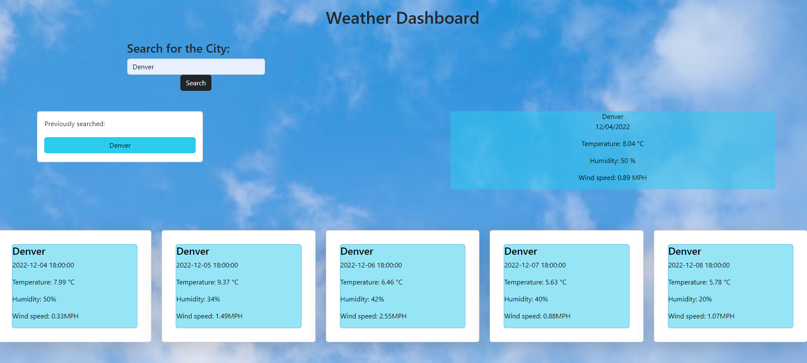

# Weather-Dashboard

## Description
Weather Dashboard is forecast weather website where you can search and get information about forecast weather for the next 5 days.
User can search for any city that is in Open Weather Map API.

---
## Installation 
 
```
No installation is required for this application. Users can access WEATHER-DASHBOARD by clicking on the URL provided in the ‘Usage’ section. 
```
---
## Usage
The access the WEATHER-DASHBOARD webpage , click the following link: 

If user searches for the city they would like to see 5 day weather forecast for result will be as below:


---
## Links
[Github Repository Link](https://github.com/Jelenarog/Weather-Dashboard)<br/>
 [Deployed website]()<br/>
 [HTML code](/assets/images/HTML-code.png)<br/>
 [JavaScript](/assets/images/Js-code.png)


---

## Credits
 [Background Image](https://www.freepik.com/free-vector/blue-cloudy-daylight-background-weather-design_3264753.htm)<br/>
Third-Party APIs: https://openweathermap.org/forecast5

---

 ---

## License 

Please refer to the LICENSE in the repo.

---


